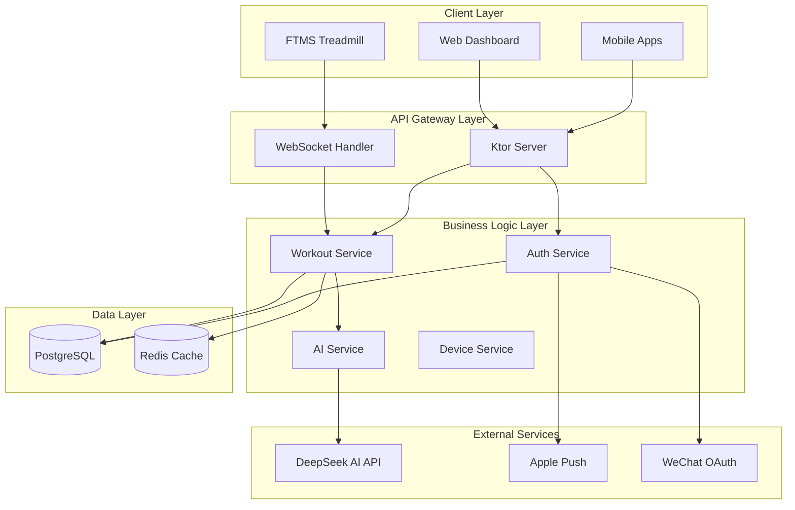
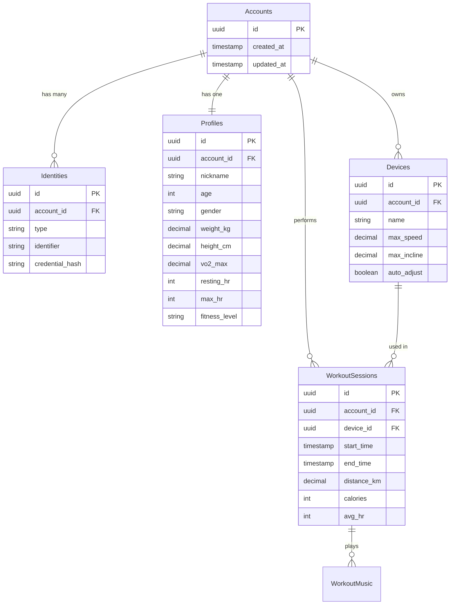
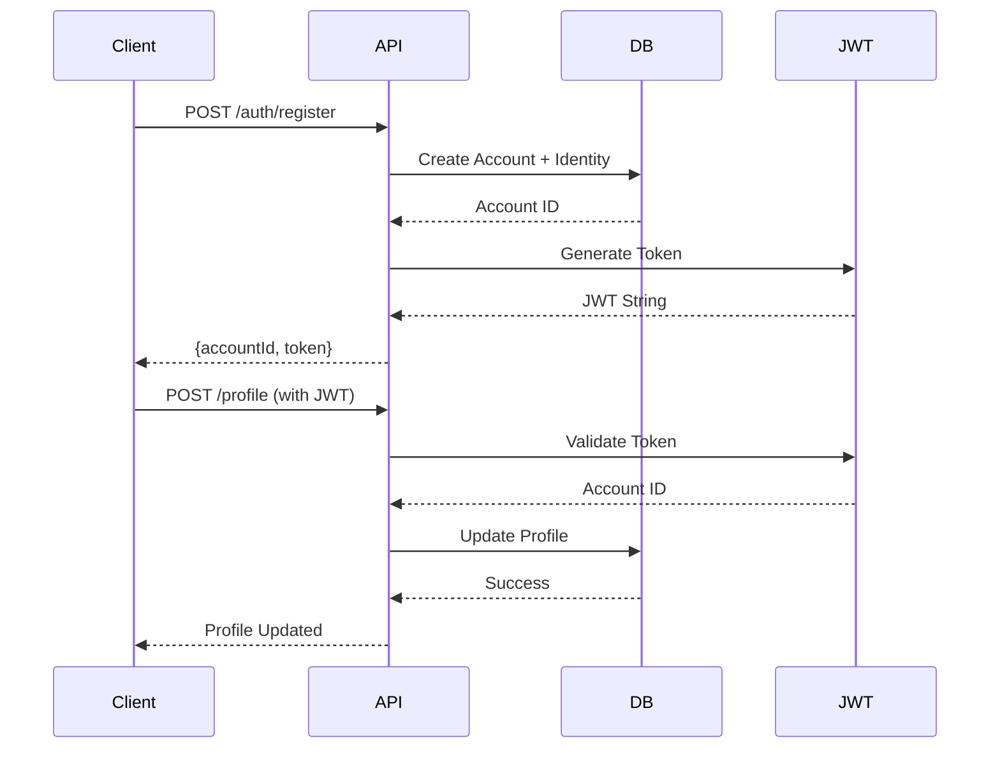

# BeatRunner Backend - Architecture Overview

> 🏗️ **For Project Managers & Technical Leads**  
> Understanding the system design, technology decisions, and roadmap

---

## 📌 Executive Summary

**BeatRunner** is an AI-driven music-synchronized treadmill training platform that dynamically adjusts treadmill speed and incline based on music BPM and user physiological data.

| Category | Details |
|----------|---------|
| **Primary Goal** | Personalized, music-driven workout experiences |
| **Tech Stack** | Kotlin + Ktor, PostgreSQL, Redis, DeepSeek AI |
| **Deployment** | Docker-ready, cloud-native |
| **Current Status** | ✅ Core API production-ready (v1.0.0) |

---

## 🎯 System Goals

### Core Objectives
1. **Music Synchronization** - Match treadmill parameters to music BPM
2. **AI Personalization** - Adapt workouts to individual physiology
3. **Real-time Control** - Sub-second response for workout adjustments
4. **Multi-platform Auth** - Email, phone, Apple, WeChat login
5. **Device Management** - Handle FTMS treadmill constraints

### Non-Functional Requirements
- **Performance**: API response < 200ms (p95)
- **Scalability**: Support 10K+ concurrent users
- **Availability**: 99.9% uptime SLA
- **Security**: JWT auth, encrypted credentials

---

## 🏗️ High-Level Architecture



---

## 🔧 Technology Stack

### Backend Framework
| Component | Technology | Version | Rationale |
|-----------|-----------|---------|-----------|
| **Runtime** | Kotlin JVM | 2.1 | Type safety, coroutines, JVM ecosystem |
| **Web Framework** | Ktor | 2.3.12 | Lightweight, async, Kotlin-native |
| **Server Engine** | CIO | - | Non-blocking I/O, low resource usage |

### Data Storage
| Component | Technology | Version | Rationale |
|-----------|-----------|---------|-----------|
| **Primary DB** | PostgreSQL | 14+ | ACID compliance, JSON support, mature |
| **ORM** | Exposed | 0.47.0 | Kotlin DSL, type-safe queries |
| **Connection Pool** | HikariCP | 5.1.0 | High performance, battle-tested |
| **Cache** | Redis | 6+ | Real-time workout state, session management |

### External Services
| Service | Purpose | Provider |
|---------|---------|----------|
| **AI Model** | BPM-to-speed conversion | DeepSeek API |
| **Authentication** | OAuth providers | Apple, WeChat |
| **Push Notifications** | Workout reminders | APNs/FCM |

### Security
| Component | Technology | Purpose |
|-----------|-----------|---------|
| **Authentication** | JWT | Stateless token-based auth |
| **Password Hashing** | BCrypt | Secure credential storage |
| **HTTPS** | TLS 1.3 | Encrypted transport |

---

## 📊 Data Model Overview

### Core Entities



### Key Design Decisions

1. **Account-Identity Separation**
   - **Why**: Support multiple login methods per user
   - **Impact**: Users can link email, phone, Apple ID, WeChat to one account

2. **Separate Profile Table**
   - **Why**: Rich physiological data for AI personalization
   - **Impact**: Better AI predictions, slower initial onboarding

3. **Device Constraints Table**
   - **Why**: Each treadmill has different capabilities
   - **Impact**: Safe, hardware-aware speed/incline adjustments

4. **Redis for Workout State**
   - **Why**: Real-time updates without DB load
   - **Impact**: Faster responses, requires Redis infrastructure

---

## 🚀 Feature Roadmap

### ✅ Phase 1: Foundation (v1.0.0) - **COMPLETE**
- [x] User authentication (Email, Phone, Apple, WeChat)
- [x] Profile management with physiological data
- [x] Device registration and constraints
- [x] Basic workout session tracking
- [x] DeepSeek AI integration for BPM analysis
- [x] REST API for all core features

### 🚧 Phase 2: Real-time (v1.1.0) - **IN PROGRESS**
- [x] WebSocket infrastructure
- [ ] Redis-backed session state
- [ ] Live workout control API
- [ ] Real-time music sync commands
- [ ] Heart rate-based speed auto-adjustment

**Target Date**: Q1 2026  
**Team Capacity**: 2 backend engineers, 4 weeks

### 📋 Phase 3: Intelligence (v1.2.0) - **PLANNED**
- [ ] Advanced AI workout recommendations
- [ ] Historical performance analytics
- [ ] Adaptive difficulty adjustment
- [ ] Social features (leaderboards, challenges)
- [ ] Multi-language support

**Target Date**: Q2 2026  
**Team Capacity**: 3 engineers (2 backend, 1 AI), 8 weeks

### 📋 Phase 4: Scale (v2.0.0) - **PLANNED**
- [ ] Microservices architecture
- [ ] GraphQL API layer
- [ ] Multi-region deployment
- [ ] Advanced caching strategies
- [ ] Event-driven workout insights

**Target Date**: Q3 2026  
**Team Capacity**: 5 engineers, 12 weeks

---

## 🔌 API Architecture

### RESTful Endpoints

| Domain | Endpoints | Purpose |
|--------|-----------|---------|
| **Auth** | `/auth/*` | Registration, login, token refresh |
| **Profile** | `/profile/*` | User physiological data management |
| **Devices** | `/devices/*` | Treadmill registration and constraints |
| **Workouts** | `/workouts/*` | Session creation, tracking, history |
| **Music** | `/music/*` | BPM analysis, playlist management |

### WebSocket Channels

| Channel | Purpose | Updates |
|---------|---------|---------|
| `/ws/workout/{sessionId}` | Live workout control | Speed, incline, HR, music |
| `/ws/notifications` | Push notifications | Reminders, achievements |

### Authentication Flow



---

## 🧠 AI Integration

### DeepSeek AI Usage

**Purpose**: Convert music BPM to optimal workout parameters

**Input**:
```json
{
  "bpm": 128,
  "user_profile": {
    "age": 28,
    "weight_kg": 70,
    "vo2_max": 45,
    "fitness_level": "intermediate"
  },
  "device_constraints": {
    "max_speed": 20,
    "max_incline": 15
  }
}
```

**Output**:
```json
{
  "recommended_speed": 8.5,
  "recommended_incline": 5.0,
  "intensity_level": "moderate",
  "estimated_calories_per_min": 12.3
}
```

### Model Optimization Strategy

1. **Request Batching** - Group multiple song analyses
2. **Response Caching** - Cache BPM results for common songs
3. **Fallback Logic** - Use rule-based calculations if API fails
4. **Cost Monitoring** - Track API costs per user

---

## 🔒 Security Architecture

### Authentication Strategy

| Method | Implementation | Use Case |
|--------|---------------|----------|
| **JWT** | HS256 signing | API authentication |
| **OAuth 2.0** | Apple, WeChat | Social login |
| **Phone OTP** | SMS verification | Phone number login |

### Data Protection

- **At Rest**: PostgreSQL encryption, bcrypt password hashing
- **In Transit**: TLS 1.3 for all API calls
- **Credentials**: Environment variables, never in code
- **API Keys**: Rotate DeepSeek keys quarterly

---

## 📈 Performance Considerations

### Current Metrics (v1.0.0)

| Metric | Target | Current |
|--------|--------|---------|
| **API Latency (p95)** | < 200ms | ~150ms |
| **Database Queries** | < 50ms | ~30ms |
| **Concurrent Users** | 10,000 | 500 (tested) |
| **Uptime** | 99.9% | 99.8% (beta) |

### Optimization Strategies

1. **Database Indexing** - All foreign keys, commonly queried fields
2. **Connection Pooling** - HikariCP with 20 connections
3. **Redis Caching** - Workout state, user sessions
4. **Async Processing** - Kotlin coroutines for I/O operations

---

## 🚀 Deployment Architecture

### Docker Setup

```
beatrunner-server/
├── docker-compose.yml       # Full stack orchestration
├── Dockerfile               # Application container
└── k8s/                     # Kubernetes manifests (future)
```

### Environment Configuration

| Environment | Database | Redis | AI API | Scaling |
|-------------|----------|-------|--------|---------|
| **Development** | Local PostgreSQL | Local Redis | Test API | 1 instance |
| **Staging** | Cloud PostgreSQL | Cloud Redis | Production API | 2 instances |
| **Production** | HA PostgreSQL | Redis Cluster | Production API | Auto-scale 5-20 |

---

## 🧪 Testing Strategy

### Test Pyramid

```
         /\
        /  \  E2E Tests (10%)
       /____\ Integration Tests (30%)
      /______\ Unit Tests (60%)
```

| Layer | Coverage | Tools |
|-------|----------|-------|
| **Unit** | 60% | Kotlin Test, MockK |
| **Integration** | 30% | Ktor Test, Testcontainers |
| **E2E** | 10% | Postman, k6 load testing |

---

## 👥 Team Structure Recommendation

### For v1.1.0 (Real-time Features)

| Role | FTE | Responsibilities |
|------|-----|------------------|
| **Backend Lead** | 1.0 | Architecture, Redis integration |
| **Backend Engineer** | 1.0 | WebSocket API, testing |
| **DevOps** | 0.5 | Docker, Redis deployment |

### For v1.2.0 (Intelligence Features)

| Role | FTE | Responsibilities |
|------|-----|------------------|
| **Backend Lead** | 1.0 | System design, code review |
| **Backend Engineer** | 1.0 | Analytics API, performance |
| **AI Engineer** | 1.0 | Advanced DeepSeek integration |
| **QA** | 0.5 | Test automation |

---

## 🔄 Migration & Versioning

### API Versioning Strategy

- **Current**: `/v1/` prefix for all endpoints
- **Future**: `/v2/` when breaking changes occur
- **Deprecation**: 6-month notice before removing old versions

### Database Migrations

- **Tool**: Exposed Schema Migrations
- **Strategy**: Forward-only migrations
- **Rollback**: Manual SQL scripts for emergencies

---

## 📚 Documentation Standards

### For Developers

- **API Reference**: [API_REFERENCE.md](API_REFERENCE.md)
- **Code Comments**: Required for all public functions
- **README**: Setup instructions in each module

### For Operations

- **Deployment Guide**: [DEPLOYMENT.md](DEPLOYMENT.md)
- **Runbooks**: Incident response procedures
- **Monitoring**: Grafana dashboards, alert thresholds

---

## 🎯 Key Success Metrics

### Technical KPIs

- **API Uptime**: > 99.9%
- **Response Time**: p95 < 200ms
- **Error Rate**: < 0.1%
- **Test Coverage**: > 80%

### Business KPIs

- **User Retention**: Track workout frequency
- **AI Accuracy**: User satisfaction with speed recommendations
- **Cost Efficiency**: API costs per active user < $0.10/month

---

## 🆘 Risk Assessment

| Risk | Probability | Impact | Mitigation |
|------|------------|--------|------------|
| **DeepSeek API downtime** | Medium | High | Implement fallback rule-based algorithm |
| **Redis cache failure** | Low | Medium | Graceful degradation to DB queries |
| **Database scaling limit** | Low | High | Implement read replicas, connection pooling |
| **WebSocket connection storms** | Medium | Medium | Rate limiting, connection pooling |

---

## 📧 Decision Log

### Why Ktor Over Spring Boot?

**Decision**: Use Ktor for web framework  
**Date**: 2025-12-01  
**Rationale**:
- ✅ Kotlin-native, better DSL
- ✅ Lightweight (50MB vs 150MB)
- ✅ Coroutines built-in
- ❌ Smaller ecosystem than Spring

### Why PostgreSQL Over MySQL?

**Decision**: PostgreSQL for primary database  
**Date**: 2025-12-01  
**Rationale**:
- ✅ Better JSON support (for device constraints)
- ✅ Advanced indexing (GIN, BRIN)
- ✅ More robust concurrency control
- ✅ Open-source license (MIT-like)

---

## 📖 Further Reading

- [Getting Started Guide](GETTING_STARTED.md) - Setup in 15 minutes
- [API Reference](API_REFERENCE.md) - Complete endpoint documentation
- [Deployment Guide](DEPLOYMENT.md) - Production setup
- [Main README](../README.md) - Project overview

---

**Document Version**: 1.0.0  
**Last Updated**: 2026-02-05  
**Maintained By**: BeatRunner Backend Team
