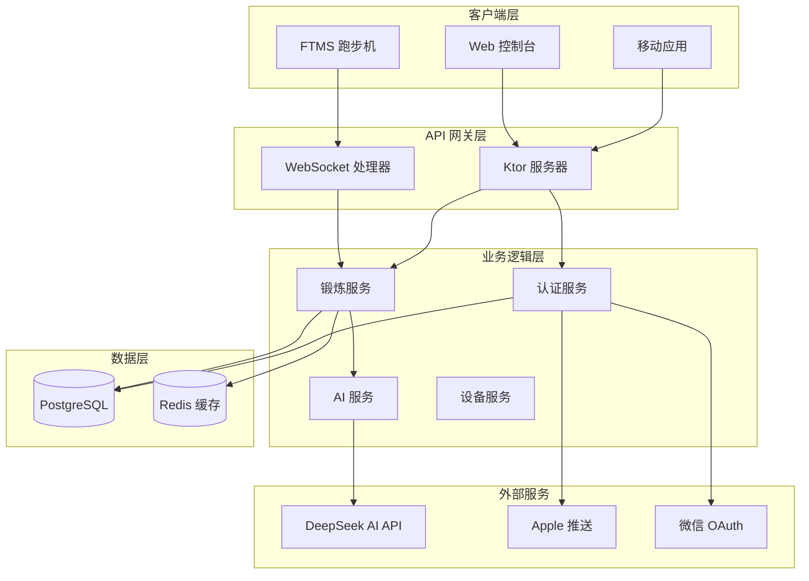
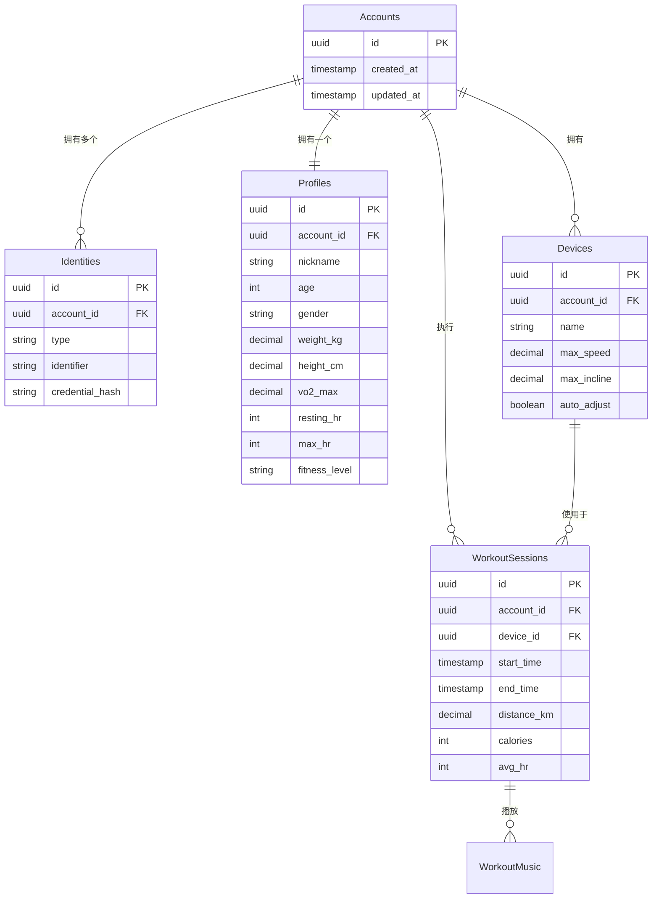
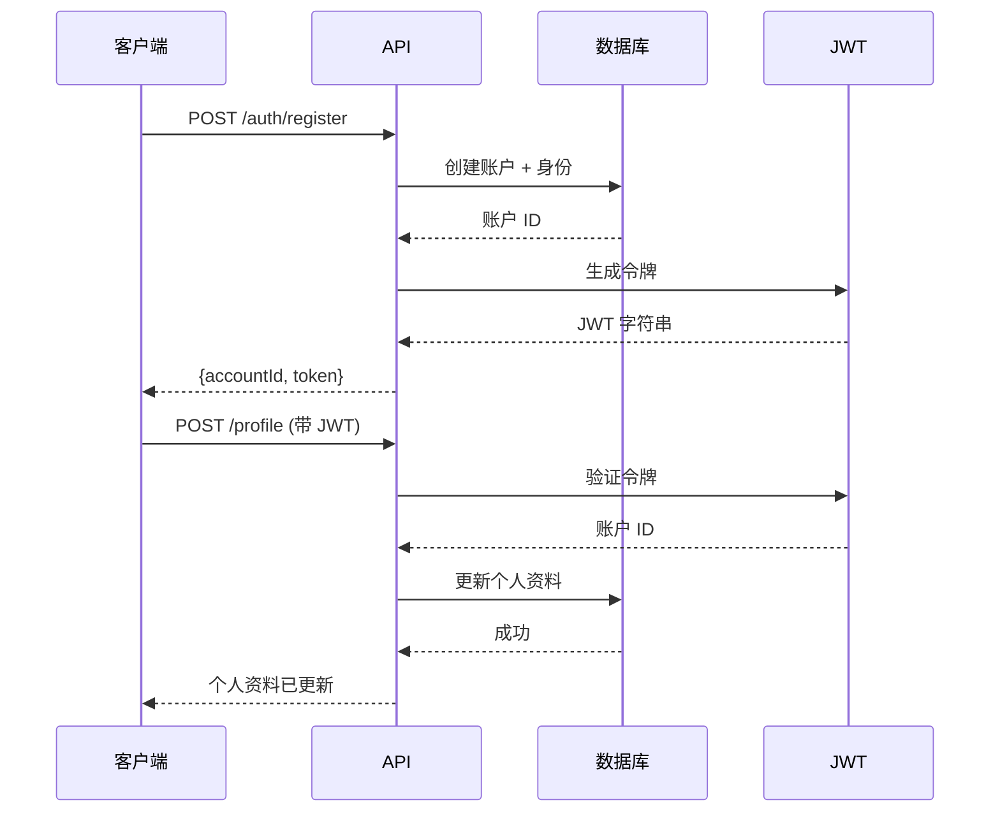

# BeatRunner 后端 - 架构概览

> 🏗️ **项目经理 & 技术负责人**  
> 系统设计、技术决策和路线图

---

## 📌 执行摘要

**BeatRunner** 是一个 AI 驱动的音乐同步跑步机训练平台，可根据音乐 BPM 和用户生理数据动态调整跑步机速度和坡度。

| 类别 | 详情 |
|------|------|
| **主要目标** | 个性化、音乐驱动的锻炼体验 |
| **技术栈** | Kotlin + Ktor、PostgreSQL、Redis、DeepSeek AI |
| **部署方式** | Docker-ready、云原生 |
| **当前状态** | ✅ 核心 API 已可生产环境使用 (v1.0.0) |

---

## 🎯 系统目标

### 核心目标
1. **音乐同步** - 将跑步机参数与音乐 BPM 匹配
2. **AI 个性化** - 根据个人生理特征调整锻炼
3. **实时控制** - 锻炼调整响应时间 < 1秒
4. **多平台认证** - 支持邮箱、手机、Apple、微信登录
5. **设备管理** - 处理 FTMS 跑步机约束

### 非功能性需求
- **性能**: API 响应时间 < 200ms (p95)
- **可扩展性**: 支持 10K+ 并发用户
- **可用性**: 99.9% 运行时间 SLA
- **安全性**: JWT 认证、加密凭据

---

## 🏗️ 高层架构



---

## 🔧 技术栈

### 后端框架
| 组件 | 技术 | 版本 | 选择理由 |
|------|------|------|----------|
| **运行时** | Kotlin JVM | 2.1 | 类型安全、协程、JVM 生态系统 |
| **Web 框架** | Ktor | 2.3.12 | 轻量级、异步、Kotlin 原生 |
| **服务器引擎** | CIO | - | 非阻塞 I/O、低资源占用 |

### 数据存储
| 组件 | 技术 | 版本 | 选择理由 |
|------|------|------|----------|
| **主数据库** | PostgreSQL | 14+ | ACID 合规、JSON 支持、成熟稳定 |
| **ORM** | Exposed | 0.47.0 | Kotlin DSL、类型安全查询 |
| **连接池** | HikariCP | 5.1.0 | 高性能、久经考验 |
| **缓存** | Redis | 6+ | 实时锻炼状态、会话管理 |

### 外部服务
| 服务 | 用途 | 提供商 |
|------|------|--------|
| **AI 模型** | BPM 到速度转换 | DeepSeek API |
| **认证** | OAuth 提供商 | Apple、微信 |
| **推送通知** | 锻炼提醒 | APNs/FCM |

### 安全
| 组件 | 技术 | 用途 |
|------|------|------|
| **认证** | JWT | 无状态令牌认证 |
| **密码哈希** | BCrypt | 安全凭据存储 |
| **HTTPS** | TLS 1.3 | 加密传输 |

---

## 📊 数据模型概览

### 核心实体



### 关键设计决策

1. **账户-身份分离**
   - **原因**: 支持每个用户多种登录方式
   - **影响**: 用户可将邮箱、手机、Apple ID、微信关联到一个账户

2. **独立的个人资料表**
   - **原因**: 丰富的生理数据用于 AI 个性化
   - **影响**: 更好的 AI 预测、较慢的初始注册流程

3. **设备约束表**
   - **原因**: 每台跑步机具有不同能力
   - **影响**: 安全、感知硬件的速度/坡度调整

4. **Redis 用于锻炼状态**
   - **原因**: 实时更新无需数据库负载
   - **影响**: 更快的响应、需要 Redis 基础设施

---

## 🚀 功能路线图

### ✅ 阶段 1: 基础 (v1.0.0) - **已完成**
- [x] 用户认证 (邮箱、手机、Apple、微信)
- [x] 具有生理数据的个人资料管理
- [x] 设备注册和约束
- [x] 基本锻炼会话跟踪
- [x] DeepSeek AI 集成 BPM 分析
- [x] 所有核心功能的 REST API

### 🚧 阶段 2: 实时 (v1.1.0) - **进行中**
- [x] WebSocket 基础设施
- [ ] Redis 支持的会话状态
- [ ] 实时锻炼控制 API
- [ ] 实时音乐同步命令
- [ ] 基于心率的速度自动调整

**目标日期**: 2026 年 Q1  
**团队容量**: 2 名后端工程师，4 周

### 📋 阶段 3: 智能化 (v1.2.0) - **已计划**
- [ ] 高级 AI 锻炼推荐
- [ ] 历史表现分析
- [ ] 自适应难度调整
- [ ] 社交功能 (排行榜、挑战)
- [ ] 多语言支持

**目标日期**: 2026 年 Q2  
**团队容量**: 3 名工程师 (2 名后端，1 名 AI)，8 周

### 📋 阶段 4: 扩展 (v2.0.0) - **已计划**
- [ ] 微服务架构
- [ ] GraphQL API 层
- [ ] 多区域部署
- [ ] 高级缓存策略
- [ ] 事件驱动的锻炼洞察

**目标日期**: 2026 年 Q3  
**团队容量**: 5 名工程师，12 周

---

## 🔌 API 架构

### RESTful 端点

| 域 | 端点 | 用途 |
|----|------|------|
| **认证** | `/auth/*` | 注册、登录、令牌刷新 |
| **个人资料** | `/profile/*` | 用户生理数据管理 |
| **设备** | `/devices/*` | 跑步机注册和约束 |
| **锻炼** | `/workouts/*` | 会话创建、跟踪、历史 |
| **音乐** | `/music/*` | BPM 分析、播放列表管理 |

### WebSocket 频道

| 频道 | 用途 | 更新内容 |
|------|------|----------|
| `/ws/workout/{sessionId}` | 实时锻炼控制 | 速度、坡度、心率、音乐 |
| `/ws/notifications` | 推送通知 | 提醒、成就 |

### 认证流程



---

## 🧠 AI 集成

### DeepSeek AI 使用

**用途**: 将音乐 BPM 转换为最佳锻炼参数

**输入**:
```json
{
  "bpm": 128,
  "user_profile": {
    "age": 28,
    "weight_kg": 70,
    "vo2_max": 45,
    "fitness_level": "intermediate"
  },
  "device_constraints": {
    "max_speed": 20,
    "max_incline": 15
  }
}
```

**输出**:
```json
{
  "recommended_speed": 8.5,
  "recommended_incline": 5.0,
  "intensity_level": "moderate",
  "estimated_calories_per_min": 12.3
}
```

### 模型优化策略

1. **请求批处理** - 对多首歌曲分析进行分组
2. **响应缓存** - 缓存常见歌曲的 BPM 结果
3. **降级逻辑** - 如果 API 失败，使用基于规则的计算
4. **成本监控** - 跟踪每个用户的 API 成本

---

## 🔒 安全架构

### 认证策略

| 方法 | 实现 | 使用场景 |
|------|------|----------|
| **JWT** | HS256 签名 | API 认证 |
| **OAuth 2.0** | Apple、微信 | 社交登录 |
| **手机 OTP** | 短信验证 | 手机号登录 |

### 数据保护

- **静态数据**: PostgreSQL 加密、bcrypt 密码哈希
- **传输中**: 所有 API 调用使用 TLS 1.3
- **凭据**: 环境变量、永不写入代码
- **API 密钥**: 每季度轮换 DeepSeek 密钥

---

## 📈 性能考虑

### 当前指标 (v1.0.0)

| 指标 | 目标 | 当前 |
|------|------|------|
| **API 延迟 (p95)** | < 200ms | ~150ms |
| **数据库查询** | < 50ms | ~30ms |
| **并发用户** | 10,000 | 500 (已测试) |
| **正常运行时间** | 99.9% | 99.8% (测试版) |

### 优化策略

1. **数据库索引** - 所有外键、常查询字段
2. **连接池** - HikariCP，20 个连接
3. **Redis 缓存** - 锻炼状态、用户会话
4. **异步处理** - Kotlin 协程用于 I/O 操作

---

## 🚀 部署架构

### Docker 设置

```
beatrunner-server/
├── docker-compose.yml       # 完整堆栈编排
├── Dockerfile               # 应用程序容器
└── k8s/                     # Kubernetes 清单 (未来)
```

### 环境配置

| 环境 | 数据库 | Redis | AI API | 扩展 |
|------|--------|-------|--------|------|
| **开发** | 本地 PostgreSQL | 本地 Redis | 测试 API | 1 实例 |
| **预发布** | 云 PostgreSQL | 云 Redis | 生产 API | 2 实例 |
| **生产** | 高可用 PostgreSQL | Redis 集群 | 生产 API | 自动扩展 5-20 |

---

## 🧪 测试策略

### 测试金字塔

```
         /\
        /  \  E2E 测试 (10%)
       /____\ 集成测试 (30%)
      /______\ 单元测试 (60%)
```

| 层 | 覆盖率 | 工具 |
|----|--------|------|
| **单元** | 60% | Kotlin Test、MockK |
| **集成** | 30% | Ktor Test、Testcontainers |
| **E2E** | 10% | Postman、k6 负载测试 |

---

## 👥 推荐团队结构

### v1.1.0 (实时功能)

| 角色 | FTE | 职责 |
|------|-----|------|
| **后端负责人** | 1.0 | 架构、Redis 集成 |
| **后端工程师** | 1.0 | WebSocket API、测试 |
| **DevOps** | 0.5 | Docker、Redis 部署 |

### v1.2.0 (智能化功能)

| 角色 | FTE | 职责 |
|------|-----|------|
| **后端负责人** | 1.0 | 系统设计、代码审查 |
| **后端工程师** | 1.0 | 分析 API、性能 |
| **AI 工程师** | 1.0 | 高级 DeepSeek 集成 |
| **QA** | 0.5 | 测试自动化 |

---

## 🔄 迁移与版本控制

### API 版本策略

- **当前**: 所有端点使用 `/v1/` 前缀
- **未来**: 发生破坏性更改时使用 `/v2/`
- **弃用**: 删除旧版本前 6 个月通知

### 数据库迁移

- **工具**: Exposed Schema Migrations
- **策略**: 仅向前迁移
- **回滚**: 紧急情况下手动 SQL 脚本

---

## 📚 文档标准

### 开发者

- **API 参考**: [API_REFERENCE_CN.md](API_REFERENCE_CN.md)
- **代码注释**: 所有公共函数需要
- **README**: 每个模块的设置说明

### 运维

- **部署指南**: [DEPLOYMENT.md](DEPLOYMENT.md)
- **运行手册**: 事故响应程序
- **监控**: Grafana 仪表板、警报阈值

---

## 🎯 关键成功指标

### 技术 KPI

- **API 正常运行时间**: > 99.9%
- **响应时间**: p95 < 200ms
- **错误率**: < 0.1%
- **测试覆盖率**: > 80%

### 业务 KPI

- **用户留存**: 跟踪锻炼频率
- **AI 准确性**: 用户对速度推荐的满意度
- **成本效益**: 每活跃用户 API 成本 < $0.10/月

---

## 🆘 风险评估

| 风险 | 概率 | 影响 | 缓解措施 |
|------|------|------|----------|
| **DeepSeek API 停机** | 中 | 高 | 实施基于规则的降级算法 |
| **Redis 缓存故障** | 低 | 中 | 优雅降级到数据库查询 |
| **数据库扩展限制** | 低 | 高 | 实施读副本、连接池 |
| **WebSocket 连接风暴** | 中 | 中 | 速率限制、连接池 |

---

## 📧 决策日志

### 为什么选择 Ktor 而不是 Spring Boot?

**决策**: 使用 Ktor 作为 Web 框架  
**日期**: 2025-12-01  
**理由**:
- ✅ Kotlin 原生、更好的 DSL
- ✅ 轻量级 (50MB vs 150MB)
- ✅ 内置协程
- ❌ 生态系统比 Spring 小

### 为什么选择 PostgreSQL 而不是 MySQL?

**决策**: PostgreSQL 作为主数据库  
**日期**: 2025-12-01  
**理由**:
- ✅ 更好的 JSON 支持 (用于设备约束)
- ✅ 高级索引 (GIN、BRIN)
- ✅ 更强大的并发控制
- ✅ 开源许可证 (类似 MIT)

---

## 📖 扩展阅读

- [快速上手指南](GETTING_STARTED_CN.md) - 15 分钟搭建
- [API 参考](API_REFERENCE_CN.md) - 完整端点文档
- [部署指南](DEPLOYMENT.md) - 生产环境设置
- [主 README](../README.md) - 项目概览

---

**文档版本**: 1.0.0  
**最后更新**: 2026-02-05  
**维护者**: BeatRunner 后端团队
